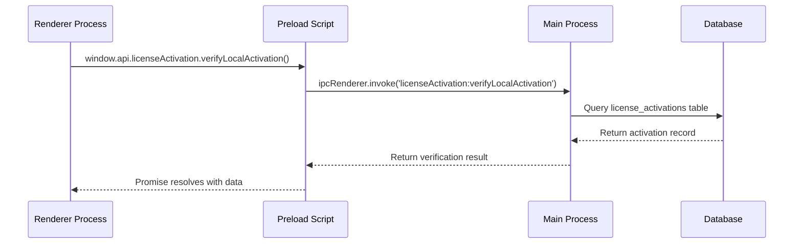

EGEL Simulator is built on **Electron**, combining a Node.js backend with a React-based frontend. This architecture provides native desktop capabilities while leveraging modern web technologies.

## Electron Multi-Process Architecture

<AccordionGroup>
  <Accordion title="Main Process" icon="server" defaultOpen>
    The main process is the Node.js backend that controls the application lifecycle, creates windows, and manages system resources.

    **Location:** `main/main.js`

    ### Key Responsibilities

    - Window management via `BrowserWindow`
    - Database initialization and synchronization
    - IPC handler registration
    - Native system integration

    ### Window Creation

    ```javascript main/main.js:7-31
    function createWindow() {
        const win = new BrowserWindow({
            width: 900,
            height: 700,
            minWidth: 400,
            minHeight: 500,
            resizable: true,
            webPreferences: {
                preload: path.join(__dirname, 'preload.js'),
                nodeIntegration: false,
                contextIsolation: true,
                devTools: !app.isPackaged,
            },
            autoHideMenuBar: true,
        });

        if (!app.isPackaged) {
            win.loadURL('http://localhost:5173');
            win.webContents.openDevTools();
        } else {
            win.loadFile(path.join(__dirname, '../renderer/dist/index.html'));
        }

        win.show();
    }
    ```

    <Note>
      Security is enforced with `nodeIntegration: false` and `contextIsolation: true`, preventing direct Node.js access from renderer code.
    </Note>

    ### Application Lifecycle

    ```javascript main/main.js:35-43
    app.whenReady().then(async () => {
        try {
            await db.sequelize.sync({ force: false });
            registerIpcHandlers();
            createWindow();
        } catch (error) {
            console.error(error);
        }
    });
    ```

    The startup sequence:
    1. Wait for Electron app to be ready
    2. Synchronize SQLite database schema (non-destructive)
    3. Register all IPC communication handlers
    4. Create and display the application window

  </Accordion>

  <Accordion title="Renderer Process" icon="window">
    The renderer process runs the React UI in a Chromium browser context. Each window is a separate renderer process.

    **Location:** `renderer/src/`

    ### Technology Stack

    - **React 18** with TypeScript
    - **React Router** for navigation
    - **Zustand** for state management
    - **Tailwind CSS** for styling
    - **Vite** for development and bundling

    ### Application Entry Point

    ```typescript renderer/src/App.tsx:7-17
    function App() {
      const refresh = useLicenseStore((state) => state.refresh);

      useEffect(() => {
        refresh();
      }, [refresh]);

      const AppRoutes = () => useRoutes(appRoutes)
      return (
        <AppRoutes />
      );
    }
    ```

    The app initializes by:
    1. Refreshing license validation state via IPC
    2. Rendering routes based on authentication status

    ### Routing Structure

    ```typescript renderer/src/routes/routes.tsx
    export const appRoutes: RouteObject[] = [
        { path: '/', element: <AuthLoader /> },
        { path: '/auth', element: <AuthPage /> },
        { path: '/home', element: <HomePage /> },
        { path: '/setup', element: <SetupPage /> },
        { path: '/history', element: <HistoryPage /> },
        { path: '/test', element: <TestPage /> }
    ];
    ```

  </Accordion>

  <Accordion title="Preload Script" icon="shield-halved">
    The preload script creates a secure bridge between the main and renderer processes using Electron's `contextBridge`.

    **Location:** `main/preload.js`

    ### Context Bridge API

    ```javascript main/preload.js:10-38
    contextBridge.exposeInMainWorld('api', {
        licenseActivation: {
            findByProductKey: (productKey) => 
                ipcRenderer.invoke('licenseActivation:findByProductKey', productKey),

            verifyLocalActivation: () => 
                ipcRenderer.invoke('licenseActivation:verifyLocalActivation'),

            verifyAndActivateKey: (productKey) => 
                ipcRenderer.invoke('licenseActivation:verifyAndActivateKey', productKey),
        },
    });
    ```

    This exposes `window.api.licenseActivation` methods to the renderer, allowing secure IPC calls without exposing Node.js internals.

    <Info>
      The preload script runs in an isolated context with access to both Node.js APIs and the renderer's DOM, but variables don't leak between contexts.
    </Info>

  </Accordion>
</AccordionGroup>

## IPC (Inter-Process Communication)

### Communication Flow



### Handler Registration

All IPC handlers are registered in `main/ipc/index.js`:

```javascript main/ipc/index.js:3-8
const registerIpcHandlers = () => {
    registerLicenseActivationHandlers();
};
```

### Example Handler Implementation

```javascript main/ipc/handlers/licenseActivation.handler.js:171-197
ipcMain.handle('licenseActivation:verifyLocalActivation', async () => {
    const machineId = machineIdSync();

    try {
        const license = await licenseActivationService.findFirst();

        if (!license) {
            return errorResponse('NO_LOCAL_LICENSE', 
                'No se encontró una licencia local para validar.');
        }

        const payload = {
            productKey: license.productKey,
            machineId
        };

        const isValid = verifySignature(payload, license.signature);

        if (!isValid) {
            await licenseActivationService.delete(license.id);
            return errorResponse('INVALID_SIGNATURE', 
                'La firma de la licencia no es válida.');
        }

        return successResponse(license);
    } catch (err) {
        return errorResponse('VALIDATION_ERROR', err.message);
    }
});
```

<Note>
  IPC handlers use `ipcMain.handle()` for async request-response patterns, returning Promises that resolve in the renderer.
</Note>

## Frontend Architecture

### State Management with Zustand

EGEL Simulator uses three Zustand stores for client-side state:

<CardGroup cols={3}>
  <Card title="License Store" icon="key">
    Manages license validation state
    
    **Location:** `renderer/src/features/auth/hooks/useLicenseStore.tsx`
  </Card>
  <Card title="Setup Store" icon="gear">
    Holds simulation configuration
    
    **Location:** `renderer/src/features/EGEL/hooks/useSetupStore.tsx`
  </Card>
  <Card title="History Store" icon="clock-rotate-left">
    Persists test history to localStorage
    
    **Location:** `renderer/src/features/EGEL/hooks/useHistoryStore.tsx`
  </Card>
</CardGroup>

#### License Store Example

```typescript renderer/src/features/auth/hooks/useLicenseStore.tsx
import { create } from 'zustand';
import { verifyLocalKey } from '../services/verifyLocalKey';

interface LicenseState {
    isValid: boolean | null;
    loading: boolean;
    refresh: () => Promise<void>;
}

export const useLicenseStore = create<LicenseState>((set) => ({
    isValid: null,
    loading: true,
    refresh: async () => {
        set({ loading: true });
        const valid = await verifyLocalKey();
        set({ isValid: valid, loading: false });
    },
}));
```

#### History Store with Persistence

```typescript renderer/src/features/EGEL/hooks/useHistoryStore.tsx:22-39
export const useHistoryStore = create<HistoryState>()()
    persist(
        (set, get) => ({
            history: [],
            addEntry: (entry) => {
                const newEntry: HistoryItem = {
                    id: crypto.randomUUID(),
                    ...entry,
                };
                set({ history: [newEntry, ...get().history] });
            },
            clearHistory: () => set({ history: [] }),
        }),
        {
            name: 'sim-history-store',
        }
    )
);
```

<Info>
  The `persist` middleware automatically syncs state to `localStorage`, surviving app restarts.
</Info>

## Backend Architecture

### Database Layer (Sequelize + SQLite)

**Database Initialization:** `main/db/index.js:8-16`

```javascript
const storagePath = isElectron
    ? path.join(app.getPath('userData'), 'data.sqlite')
    : path.join(__dirname, 'data.sqlite');

const sequelize = new Sequelize({
    dialect: 'sqlite',
    storage: storagePath,
    logging: false,
});
```

The database file is stored in the user data directory:
- **Windows:** `%APPDATA%/egel-simulator/data.sqlite`
- **macOS:** `~/Library/Application Support/egel-simulator/data.sqlite`
- **Linux:** `~/.config/egel-simulator/data.sqlite`

### Service Layer

Services encapsulate business logic and database operations:

- `licenseActivationService` - CRUD operations for license activations
- `licenseRemoteService` - Remote license verification via Supabase

### External Dependencies

```json package.json:22-30
"dependencies": {
    "@supabase/supabase-js": "^2.51.0",
    "crypto": "^1.0.1",
    "dotenv": "^17.2.0",
    "lucide-react": "^0.525.0",
    "node-machine-id": "^1.1.12",
    "sequelize": "^6.37.7",
    "sqlite3": "^5.1.7"
}
```

- **Supabase:** Remote license validation
- **node-machine-id:** Hardware fingerprinting for license binding
- **Sequelize:** ORM for SQLite operations

## Build System

### Development Mode

```json package.json:7-9
"dev": "concurrently -k \"npm:dev:*\"",
"dev:main": "electron main/main.js",
"dev:renderer": "npm --prefix renderer run dev"
```

Runs two processes concurrently:
1. **Electron main process** loading from `main/main.js`
2. **Vite dev server** on `http://localhost:5173`

The main process detects `!app.isPackaged` and loads the dev server URL.

### Vite Configuration

```typescript renderer/vite.config.ts
import { defineConfig } from 'vite'
import react from '@vitejs/plugin-react-swc'
import tailwindcss from '@tailwindcss/vite'

export default defineConfig({
  plugins: [
    react(),        // Fast Refresh with SWC compiler
    tailwindcss(),  // Tailwind CSS v4 integration
  ],
})
```

### Production Build

```json package.json:12-13
"build:renderer": "npm --prefix renderer run build",
"build": "npm run build:renderer && electron-builder"
```

Build pipeline:
1. **Vite builds** the renderer to `renderer/dist/`
2. **Electron Builder** packages the app with the built renderer

The packaged app loads from `../renderer/dist/index.html` (main/main.js:27).

<Warning>
  Always run `build:renderer` before `electron-builder`, or the package will contain outdated UI code.
</Warning>

## Architecture Diagram

```
┌─────────────────────────────────────────────────────────────┐
│                      EGEL Simulator                         │
├─────────────────────────────────────────────────────────────┤
│                                                             │
│  ┌─────────────────┐         ┌──────────────────────┐     │
│  │  Renderer        │         │   Main Process       │     │
│  │  (Chromium)      │   IPC   │   (Node.js)          │     │
│  │                  │◄───────►│                      │     │
│  │  - React UI      │         │  - Window Manager    │     │
│  │  - Zustand       │         │  - IPC Handlers      │     │
│  │  - React Router  │         │  - Services          │     │
│  │  - Tailwind CSS  │         │  - Sequelize ORM     │     │
│  │                  │         │                      │     │
│  │  window.api.*    │         │  ipcMain.handle()    │     │
│  └─────────────────┘         └──────────┬───────────┘     │
│           │                              │                 │
│           │                              │                 │
│           │                              ▼                 │
│           │                   ┌────────────────────┐      │
│           │                   │   SQLite Database  │      │
│           │                   │                    │      │
│           │                   │  - license_activ.  │      │
│           │                   │  - app.getPath()   │      │
│           │                   └────────────────────┘      │
│           │                                                │
│           ▼                                                │
│  ┌──────────────────┐                                     │
│  │  localStorage     │                                     │
│  │  (Zustand persist)│                                     │
│  └──────────────────┘                                     │
│                                                             │
└─────────────────────────────────────────────────────────────┘
```

## Key Architectural Patterns

<AccordionGroup>
  <Accordion title="Separation of Concerns">
    - **Main process** handles system operations, security, and data persistence
    - **Renderer process** focuses purely on UI and user interactions
    - **Preload script** provides a minimal, auditable API surface
  </Accordion>

  <Accordion title="Offline-First Design">
    - All exam questions stored locally in code
    - License validation cached in SQLite
    - History stored in localStorage
    - No runtime dependency on external services
  </Accordion>

  <Accordion title="Security by Design">
    - Context isolation prevents Node.js access from renderer
    - License signatures prevent tampering
    - Machine ID binding prevents key sharing
    - DevTools disabled in production builds
  </Accordion>
</AccordionGroup>

## Related Resources

<CardGroup cols={2}>
  <Card title="Data Storage" icon="database" href="/advanced/data-storage">
    Learn about SQLite schema and state management
  </Card>
  <Card title="Customization" icon="palette" href="/advanced/customization">
    Modify questions, themes, and exam logic
  </Card>
</CardGroup>