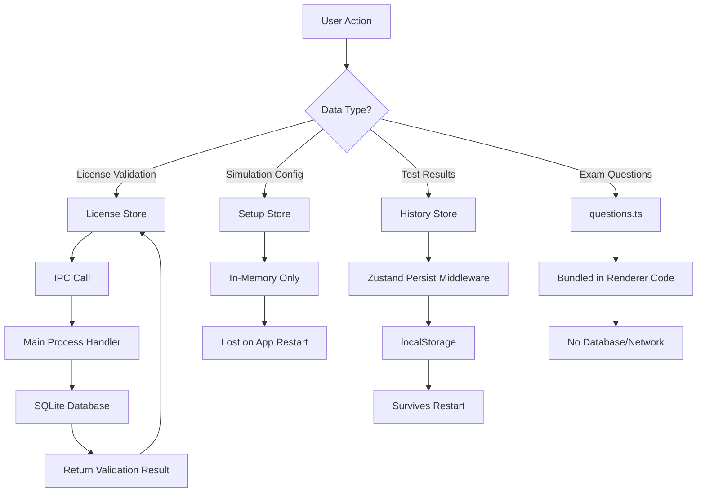

EGEL Simulator uses a hybrid storage approach combining **SQLite** for persistent data, **localStorage** for UI state, and **in-memory stores** for runtime configuration.

## SQLite Database

### Database Location

The SQLite database is stored in the Electron user data directory:

```javascript main/db/index.js:8-10
const storagePath = isElectron
    ? path.join(app.getPath('userData'), 'data.sqlite')
    : path.join(__dirname, 'data.sqlite');
```

<Tabs>
  <Tab title="Windows">
    ```
    C:\Users\<username>\AppData\Roaming\egel-simulator\data.sqlite
    ```
  </Tab>
  <Tab title="macOS">
    ```
    /Users/<username>/Library/Application Support/egel-simulator/data.sqlite
    ```
  </Tab>
  <Tab title="Linux">
    ```
    /home/<username>/.config/egel-simulator/data.sqlite
    ```
  </Tab>
</Tabs>

<Info>
  The database file is automatically created on first launch when `sequelize.sync()` is called.
</Info>

### Sequelize Setup

**Configuration:** `main/db/index.js:12-16`

```javascript
const sequelize = new Sequelize({
    dialect: 'sqlite',
    storage: storagePath,
    logging: false,  // Disable SQL query logging
});
```

### Database Synchronization

The database schema is synchronized during app startup:

```javascript main/main.js:35-43
app.whenReady().then(async () => {
    try {
        await db.sequelize.sync({ force: false });
        registerIpcHandlers();
        createWindow();
    } catch (error) {
        console.error(error);
    }
});
```

<Warning>
  `sync({ force: false })` preserves existing data. Never use `force: true` in production, as it drops and recreates all tables, deleting user data.
</Warning>

## Database Schema

### LicenseActivation Model

**Location:** `main/db/models/LicenseActivation.js`

This is currently the only table in the database, storing local license activation records.

```javascript main/db/models/LicenseActivation.js:10-40
function createLicenseActivationModel(sequelize) {
    return sequelize.define('LicenseActivation', {
        id: {
            type: DataTypes.INTEGER,
            primaryKey: true,
            autoIncrement: true,
        },
        productKey: {
            type: DataTypes.STRING,
            allowNull: false,
            unique: true,  // Prevents duplicate activations
        },
        machineId: {
            type: DataTypes.STRING,
            allowNull: false,
        },
        careerId: {
            type: DataTypes.STRING,
            allowNull: true,
        },
        activatedAt: {
            type: DataTypes.DATE,
            defaultValue: DataTypes.NOW,
        },
        signature: {
            type: DataTypes.TEXT,
            allowNull: true,
        },
    }, {
        tableName: 'license_activations',
        timestamps: false,  // No createdAt/updatedAt columns
    });
}
```

### Table Structure

| Column | Type | Constraints | Purpose |
|--------|------|-------------|----------|
| `id` | INTEGER | PRIMARY KEY, AUTO INCREMENT | Unique identifier |
| `productKey` | STRING | NOT NULL, UNIQUE | License key from activation |
| `machineId` | STRING | NOT NULL | Hardware fingerprint (via `node-machine-id`) |
| `careerId` | STRING | NULL | Optional career/program identifier |
| `activatedAt` | DATE | DEFAULT NOW | Timestamp of local activation |
| `signature` | TEXT | NULL | Cryptographic signature for tamper detection |

<Info>
  The `signature` field contains an HMAC of `{productKey, machineId}` to detect if the license record was modified outside the app.
</Info>

## Database Operations

### Service Layer

Database CRUD operations are abstracted through `licenseActivationService` (referenced in IPC handlers).

Common operations exposed via IPC:

<AccordionGroup>
  <Accordion title="Create Activation" icon="plus">
    ```javascript
    // Called from main/ipc/handlers/licenseActivation.handler.js:143-146
    const localActivation = await licenseActivationService.create({
        productKey,
        machineId,
        signature,
    });
    ```

    Creates a new license activation record after remote verification.
  </Accordion>

  <Accordion title="Find by Product Key" icon="magnifying-glass">
    ```javascript
    // Called from main/ipc/handlers/licenseActivation.handler.js:131
    const existingLocal = await licenseActivationService.findByProductKey(productKey);
    ```

    Checks if a license is already activated locally (prevents duplicates).
  </Accordion>

  <Accordion title="Verify Local Activation" icon="shield-check">
    ```javascript main/ipc/handlers/licenseActivation.handler.js:175-176
    const license = await licenseActivationService.findFirst();

    const payload = {
        productKey: license.productKey,
        machineId
    };

    const isValid = verifySignature(payload, license.signature);
    ```

    Validates the signature to ensure the license hasn't been tampered with.
  </Accordion>

  <Accordion title="Delete Activation" icon="trash">
    ```javascript main/ipc/handlers/licenseActivation.handler.js:189
    await licenseActivationService.delete(license.id);
    ```

    Removes invalid or corrupted license records.
  </Accordion>
</AccordionGroup>

## Local State Management

### Zustand Stores

While SQLite handles persistent backend data, the renderer uses Zustand for client-side state.

<CardGroup cols={3}>
  <Card title="License Store" icon="key">
    **Type:** In-memory (refreshed from SQLite via IPC)
    
    **Purpose:** License validation state
  </Card>
  <Card title="Setup Store" icon="sliders">
    **Type:** In-memory
    
    **Purpose:** Current simulation configuration
  </Card>
  <Card title="History Store" icon="clock-rotate-left">
    **Type:** Persisted to localStorage
    
    **Purpose:** Test result history
  </Card>
</CardGroup>

### License Store (In-Memory)

**Location:** `renderer/src/features/auth/hooks/useLicenseStore.tsx`

```typescript
interface LicenseState {
    isValid: boolean | null;  // null = not checked yet
    loading: boolean;
    refresh: () => Promise<void>;
}

export const useLicenseStore = create<LicenseState>((set) => ({
    isValid: null,
    loading: true,
    refresh: async () => {
        set({ loading: true });
        const valid = await verifyLocalKey();  // IPC call
        set({ isValid: valid, loading: false });
    },
}));
```

This store:
- Starts with `isValid: null` and `loading: true`
- Calls `window.api.licenseActivation.verifyLocalActivation()` via IPC
- Updates state based on SQLite validation result
- Re-runs on every app launch (see App.tsx:10-12)

### Setup Store (In-Memory)

**Location:** `renderer/src/features/EGEL/hooks/useSetupStore.tsx`

```typescript renderer/src/features/EGEL/hooks/useSetupStore.tsx:3-20
type SimulationSettings = {
  area: SimulationType;
  timerEnabled: boolean;
  duration: number;
  practiceMode: boolean;
};

type SetupStore = {
  config: SimulationSettings | null;
  setConfig: (config: SimulationSettings) => void;
  resetConfig: () => void;
};

export const useSetupStore = create<SetupStore>((set) => ({
  config: null,
  setConfig: (config) => set({ config }),
  resetConfig: () => set({ config: null }),
}));
```

<Note>
  This store holds **runtime configuration only**. It resets to `null` when the app restarts, requiring users to reconfigure each session.
</Note>

### History Store (localStorage)

**Location:** `renderer/src/features/EGEL/hooks/useHistoryStore.tsx`

```typescript renderer/src/features/EGEL/hooks/useHistoryStore.tsx:4-14
export interface HistoryItem {
    id: string;
    date: string;
    time: string;
    score: number;
    correct: number;
    total: number;
    type: SimulationType;
    timerEnabled?: boolean;
    practiceMode?: boolean;
}
```

**Persistence Implementation:**

```typescript renderer/src/features/EGEL/hooks/useHistoryStore.tsx:22-39
export const useHistoryStore = create<HistoryState>()()
    persist(
        (set, get) => ({
            history: [],
            addEntry: (entry) => {
                const newEntry: HistoryItem = {
                    id: crypto.randomUUID(),
                    ...entry,
                };
                set({ history: [newEntry, ...get().history] });
            },
            clearHistory: () => set({ history: [] }),
        }),
        {
            name: 'sim-history-store',  // localStorage key
        }
    )
);
```

The `persist` middleware:
- Saves state to `localStorage['sim-history-store']`
- Automatically rehydrates on app launch
- Survives app restarts (unlike the other stores)

<Info>
  History is stored in the **renderer's localStorage**, not in SQLite. This keeps test results client-side and avoids database writes for every simulation.
</Info>

## Data Flow Diagram



## Data Privacy & Offline Design

<AccordionGroup>
  <Accordion title="Offline-First Architecture" defaultOpen>
    - **Exam questions** are bundled in `renderer/src/features/EGEL/services/questions.ts`
    - **License validation** is cached in SQLite after initial activation
    - **Test history** is stored locally in localStorage
    - **No telemetry** or analytics data is collected

    The app can run completely offline after initial license activation.
  </Accordion>

  <Accordion title="User Data Location">
    All user data is stored on the local machine:

    1. **SQLite database** in app user data directory
    2. **localStorage** in Chromium profile (also in user data directory)
    3. **No cloud storage** or external servers (except initial license verification)
  </Accordion>

  <Accordion title="Data Portability">
    To back up user data:

    ```bash
    # Windows
    copy %APPDATA%\egel-simulator\data.sqlite backup.sqlite

    # macOS/Linux
    cp "~/Library/Application Support/egel-simulator/data.sqlite" backup.sqlite
    ```

    To export test history:
    
    Access `localStorage['sim-history-store']` from the browser DevTools console (in development mode).
  </Accordion>

  <Accordion title="License Security">
    Licenses are protected against tampering:

    1. **Machine ID binding** prevents key sharing across devices
    2. **Cryptographic signatures** detect manual database edits
    3. **Unique constraint** on `productKey` prevents duplicate activations
    4. **Remote verification** validates keys against Supabase on first activation

    Invalid signatures trigger automatic deletion of the corrupted record.
  </Accordion>
</AccordionGroup>

## Storage Locations Summary

| Data Type | Storage | Persistence | Location |
|-----------|---------|-------------|----------|
| License activation | SQLite | Permanent | `app.getPath('userData')/data.sqlite` |
| Test history | localStorage | Permanent | Renderer's Chromium profile |
| Simulation config | Zustand (memory) | Temporary | Lost on restart |
| License state | Zustand (memory) | Temporary | Refreshed from SQLite on launch |
| Exam questions | Source code | Bundled | `renderer/src/features/EGEL/services/questions.ts` |

## Database Maintenance

<Warning>
  **Backup Before Modifications**
  
  Always back up `data.sqlite` before manually modifying the database or upgrading the app.
</Warning>

### Inspecting the Database

Use any SQLite client to inspect the database:

```bash
# Install sqlite3 CLI
sqlite3 "~/Library/Application Support/egel-simulator/data.sqlite"

# View schema
.schema license_activations

# Query activations
SELECT * FROM license_activations;
```

### Resetting License Data

To force re-activation (useful for testing):

```bash
sqlite3 "path/to/data.sqlite" "DELETE FROM license_activations;"
```

Or delete the entire database file (it will be recreated on next launch).

## Related Resources

<CardGroup cols={2}>
  <Card title="Architecture" icon="sitemap" href="/advanced/architecture">
    Understand how IPC connects the renderer to SQLite
  </Card>
  <Card title="Customization" icon="code" href="/advanced/customization">
    Modify question banks and exam logic
  </Card>
</CardGroup>