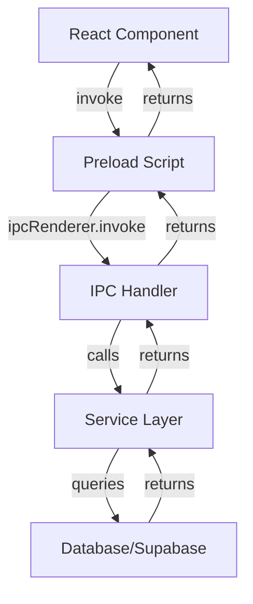

# Project Structure

EGEL Simulator follows a standard Electron application structure with separated main and renderer processes. This guide explains the organization of the codebase and the purpose of each directory.

## Overview

The project is divided into two main parts:

<CardGroup cols={2}>
  <Card title="Main Process" icon="server">
    Node.js backend handling database, IPC, and system operations
  </Card>
  <Card title="Renderer Process" icon="browser">
    React frontend providing the user interface
  </Card>
</CardGroup>

## Root Directory Structure

```
EGEL-simulator/
├── main/                    # Electron main process
│   ├── db/                  # Database models and config
│   ├── ipc/                 # IPC handlers and utilities
│   ├── services/            # Business logic services
│   ├── supabase/            # Supabase client config
│   ├── main.js              # Main entry point
│   └── preload.js           # Context bridge script
├── renderer/                # React renderer process
│   ├── public/              # Static assets
│   ├── src/                 # React source code
│   │   ├── assets/          # Images and media
│   │   ├── features/        # Feature modules
│   │   ├── pages/           # Page components
│   │   ├── routes/          # Route definitions
│   │   ├── App.tsx          # Root component
│   │   └── main.tsx         # React entry point
│   ├── index.html           # HTML template
│   ├── package.json         # Renderer dependencies
│   └── vite.config.ts       # Vite configuration
├── .env                     # Environment variables (local only)
├── .gitignore               # Git ignore rules
└── package.json             # Root dependencies and scripts
```

## Main Process (`main/`)

The main process runs Node.js and handles system-level operations, database access, and communication with the renderer.

<AccordionGroup>
  <Accordion title="main.js - Application Entry Point">
    The primary entry point for the Electron application. Creates the browser window and initializes the app.
    
    **Location**: `main/main.js`
    
    **Key Responsibilities**:
    - Creates the BrowserWindow with security settings
    - Loads the renderer (Vite dev server in dev, static files in production)
    - Initializes the database with `db.sequelize.sync()`
    - Registers IPC handlers with `registerIpcHandlers()`
    - Manages app lifecycle events (ready, window-all-closed, activate)
    
    ```javascript main/main.js
    function createWindow() {
        const win = new BrowserWindow({
            width: 900,
            height: 700,
            minWidth: 400,
            minHeight: 500,
            webPreferences: {
                preload: path.join(__dirname, 'preload.js'),
                nodeIntegration: false,
                contextIsolation: true,
            },
        });
        
        if (!app.isPackaged) {
            win.loadURL('http://localhost:5173');
        } else {
            win.loadFile(path.join(__dirname, '../renderer/dist/index.html'));
        }
    }
    ```
  </Accordion>
  
  <Accordion title="preload.js - Context Bridge">
    Exposes a safe API from the main process to the renderer using Electron's contextBridge.
    
    **Location**: `main/preload.js`
    
    **Key Responsibilities**:
    - Creates the `window.electron` API
    - Exposes IPC invoke methods to renderer
    - Maintains security by not exposing full Node.js access
    
    ```javascript main/preload.js
    const { contextBridge, ipcRenderer } = require('electron');

    contextBridge.exposeInMainWorld('electron', {
        invoke: (channel, ...args) => ipcRenderer.invoke(channel, ...args)
    });
    ```
    
    This allows the renderer to call:
    ```typescript
    window.electron.invoke('licenseActivation:findAll')
    ```
  </Accordion>
  
  <Accordion title="db/ - Database Layer">
    Contains Sequelize configuration, models, and database initialization.
    
    **Structure**:
    ```
    db/
    ├── index.js                 # Sequelize setup
    └── models/
        └── LicenseActivation.js # License model definition
    ```
    
    **Key Files**:
    - `index.js`: Configures SQLite and exports models
    - `models/LicenseActivation.js`: Defines the license schema
    
    The database file is stored at:
    - **Windows**: `%APPDATA%/egel-simulator/data.sqlite`
    - **macOS**: `~/Library/Application Support/egel-simulator/data.sqlite`
    - **Linux**: `~/.config/egel-simulator/data.sqlite`
  </Accordion>
  
  <Accordion title="ipc/ - Inter-Process Communication">
    Handles all communication between main and renderer processes.
    
    **Structure**:
    ```
    ipc/
    ├── index.js               # Registers all handlers
    ├── handlers/
    │   └── licenseActivation.handlers.js
    └── utils/
        ├── ipcResponse.js     # Response formatters
        └── signature.js       # Signature utilities
    ```
    
    **Key Components**:
    - **index.js**: Calls `registerLicenseActivationHandlers()`
    - **handlers/**: IPC handler implementations
    - **utils/**: Helper functions for responses and security
    
    All IPC channels follow the pattern: `category:action`
    - `licenseActivation:findAll`
    - `licenseActivation:create`
    - `licenseActivation:activate`
  </Accordion>
  
  <Accordion title="services/ - Business Logic">
    Service layer containing business logic and data operations.
    
    **Structure**:
    ```
    services/
    ├── licenseActivation.services.js
    └── remoteLicense.services.js
    ```
    
    **Key Services**:
    - **licenseActivation.services.js**: CRUD operations for licenses
    - **remoteLicense.services.js**: Remote validation with Supabase
    
    Services are consumed by IPC handlers and provide a clean separation between data access and API.
  </Accordion>
  
  <Accordion title="supabase/ - Cloud Integration">
    Supabase client configuration for remote license validation.
    
    **Location**: `main/supabase/`
    
    Used by `remoteLicense.services.js` to validate product keys against the cloud database.
  </Accordion>
</AccordionGroup>

## Renderer Process (`renderer/`)

The renderer process runs a React application built with Vite, providing the user interface.

<AccordionGroup>
  <Accordion title="src/ - React Source Code">
    The main source directory for all React components, hooks, and utilities.
    
    **Structure**:
    ```
    src/
    ├── assets/              # Static assets (images, icons)
    ├── features/            # Feature-based modules
    │   ├── EGEL/            # Exam-related features
    │   │   ├── components/  # Question component
    │   │   ├── hooks/       # Setup, history, questions
    │   │   └── services/    # Question data
    │   └── auth/            # Authentication features
    │       ├── components/  # Auth UI components
    │       ├── hooks/       # License store
    │       └── services/    # Auth services
    ├── pages/               # Page components
    │   ├── AuthPage.tsx     # License activation
    │   ├── HomePage.tsx     # Main menu
    │   ├── SetupPage.tsx    # Exam configuration
    │   ├── TestPage.tsx     # Exam taking
    │   └── HistoryPage.tsx  # Results history
    ├── routes/              # Route definitions
    │   └── routes.tsx       # React Router config
    ├── App.tsx              # Root component
    ├── main.tsx             # React entry point
    └── vite-env.d.ts        # TypeScript declarations
    ```
  </Accordion>
  
  <Accordion title="features/ - Feature Modules">
    Features are organized by domain with components, hooks, and services grouped together.
    
    ### EGEL Feature (`features/EGEL/`)
    
    Handles all exam-related functionality:
    
    - **components/**: `Question.tsx` - Renders individual questions
    - **hooks/**: State management hooks
      - `useSetupStore.tsx` - Exam configuration state
      - `useHistoryStore.tsx` - Test history state  
      - `useQuestions.tsx` - Question loading hook
    - **services/**: `questions.ts` - Question bank data
    
    ### Auth Feature (`features/auth/`)
    
    Manages license activation and authentication:
    
    - **components/**: `AuthLoader.tsx` - Validates license on startup
    - **hooks/**: `useLicenseStore.tsx` - License state management
    - **services/**: License validation logic
  </Accordion>
  
  <Accordion title="pages/ - Page Components">
    Top-level page components that correspond to routes.
    
    | Page | Route | Purpose |
    |------|-------|---------|
    | `AuthPage.tsx` | `/auth` | License activation UI |
    | `HomePage.tsx` | `/home` | Main menu and navigation |
    | `SetupPage.tsx` | `/setup` | Exam configuration |
    | `TestPage.tsx` | `/test` | Exam taking interface |
    | `HistoryPage.tsx` | `/history` | Test history and results |
    
    All pages are full-screen components with their own layouts and styles.
  </Accordion>
  
  <Accordion title="routes/ - React Router Configuration">
    Defines application routes using React Router v7.
    
    **Location**: `src/routes/routes.tsx`
    
    ```typescript routes/routes.tsx
    export const appRoutes: RouteObject[] = [
        { path: '/', element: <AuthLoader /> },
        { path: '/auth', element: <AuthPage /> },
        { path: '/home', element: <HomePage /> },
        { path: '/setup', element: <SetupPage /> },
        { path: '/history', element: <HistoryPage /> },
        { path: '/test', element: <TestPage /> }
    ];
    ```
    
    The root route (`/`) renders `AuthLoader` which validates the license and redirects appropriately.
  </Accordion>
</AccordionGroup>

## Configuration Files

<Tabs>
  <Tab title="package.json (Root)">
    Root package.json manages Electron and shared dependencies.
    
    ```json package.json
    {
      "name": "egel-simulator",
      "version": "1.0.0",
      "main": "main/main.js",
      "scripts": {
        "install:all": "npm install && npm install --prefix renderer",
        "dev": "concurrently -k \"npm:dev:*\"",
        "build": "npm run build:renderer && electron-builder"
      }
    }
    ```
  </Tab>
  
  <Tab title="package.json (Renderer)">
    Renderer package.json manages React and frontend dependencies.
    
    ```json renderer/package.json
    {
      "name": "renderer",
      "type": "module",
      "scripts": {
        "dev": "vite",
        "build": "tsc -b && vite build"
      }
    }
    ```
  </Tab>
  
  <Tab title="vite.config.ts">
    Vite configuration for the React renderer.
    
    ```typescript renderer/vite.config.ts
    import { defineConfig } from 'vite'
    import react from '@vitejs/plugin-react-swc'

    export default defineConfig({
      plugins: [react()],
    })
    ```
  </Tab>
  
  <Tab title=".env">
    Environment variables for Supabase and secrets.
    
    ```bash .env
    SUPABASE_URL=your_supabase_url
    SUPABASE_KEY=your_supabase_key
    SIGNATURE_SECRET=your_secret
    ```
    
    <Warning>
      Never commit `.env` to version control. Add it to `.gitignore`.
    </Warning>
  </Tab>
</Tabs>

## Data Flow

Understanding how data flows through the application:



### Example: Loading Questions

1. **Component** (`TestPage.tsx`) calls `useQuestions()` hook
2. **Hook** (`useQuestions.tsx`) calls `getQuestions()` from services
3. **Service** (`questions.ts`) filters questions based on type
4. **Data** is returned to component and rendered

### Example: License Activation

1. **Component** (`AuthPage.tsx`) calls `window.electron.invoke('licenseActivation:activate')`
2. **Preload** (`preload.js`) forwards to `ipcRenderer.invoke`
3. **Handler** (`licenseActivation.handlers.js`) calls service method
4. **Service** (`remoteLicense.services.js`) validates with Supabase
5. **Service** (`licenseActivation.services.js`) saves to database
6. **Result** propagates back through the chain

## Build Artifacts

After building for production:

```
EGEL-simulator/
├── renderer/
│   └── dist/              # Built React app
│       ├── index.html
│       ├── assets/        # Bundled JS/CSS
│       └── ...
└── dist/                  # Electron Builder output
    ├── win-unpacked/      # Windows build
    ├── mac/               # macOS build
    └── linux-unpacked/    # Linux build
```

## Next Steps

<CardGroup cols={2}>
  <Card title="Development Setup" icon="code" href="/development/setup">
    Set up your development environment
  </Card>
  <Card title="Building" icon="hammer" href="/development/building">
    Build the application for production
  </Card>
  <Card title="Architecture" icon="sitemap" href="/advanced/architecture">
    Deep dive into the architecture
  </Card>
  <Card title="Technical Reference" icon="book" href="/reference/electron-main">
    Explore the API reference
  </Card>
</CardGroup>
